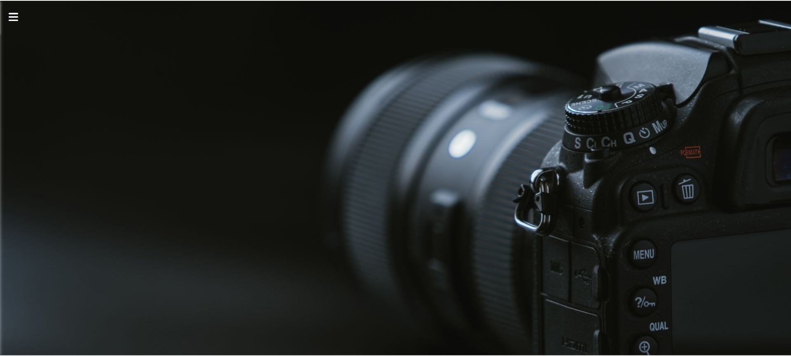
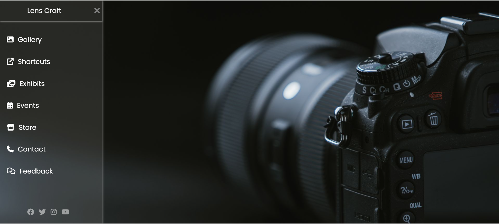

# 📷 Lens Craft

Lens Craft is a photography-themed sidebar navigation webpage built using **HTML5 and CSS3**.  
It demonstrates a clean UI layout with a **smooth toggle sidebar menu** implemented using the **CSS checkbox technique**.

This project focuses on **modern UI styling, hover interactions, and smooth transitions using pure CSS without JavaScript.**

---

## 🚀 Live Demo

🔗 https://lens-craft-project.netlify.app/

---

## 📸 Screenshots

### Main Page


### Sidebar Navigation


---

## ✨ Features

- Responsive sidebar navigation
- Smooth open/close toggle using CSS checkbox technique
- Clean and minimal UI design
- Hover effects and smooth transitions
- Social media icons integration
- Fully built using **pure HTML and CSS**

---

## 🛠 Tech Stack

- **HTML5**
- **CSS3**
- **Google Fonts (Poppins)**
- **Font Awesome Icons**

---

## 📂 Project Structure

```
Lens-Craft/
│── index.html
│── style.css
│── photo.jpg
│── assets/
│    ├── screenshot-main.png
│    ├── screenshot-sidebar.png
│── README.md
```

---

## 🎯 Learning Objectives

This project helped practice:

- Sidebar UI design
- CSS positioning and layout
- CSS transitions and hover effects
- Checkbox toggle technique
- Integrating icons using Font Awesome

---

## 👩‍💻 Author

**Salma Shaik**  
Computer Science and Engineering Student  

🔗 GitHub: https://github.com/salmashaik45
---
